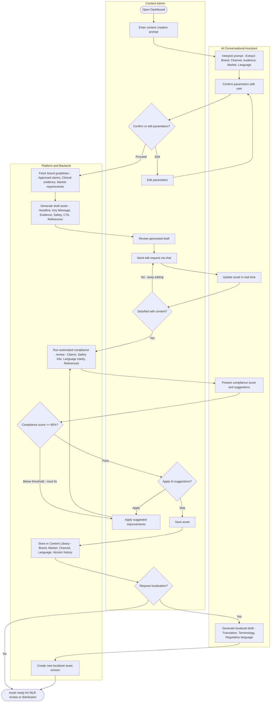

# Conversational Asset Creation — Swimlane Diagram
## For use at mermaid.live

Paste the code block below directly into [mermaid.live](https://mermaid.live) to render and export as SVG/PNG for FigJam.

---

## Worked Example — Brand X Oncology Asset for Germany

This traces a single real scenario through every node in the diagram. Use this to walk your engineering team through the flow in FigJam.

---

### Scenario Setup

> Sarah is a Content Admin at a pharma company. She needs to create a branded educational email (RTE) for Brand X, targeting oncologists in Germany, based on a recent progression-free survival clinical trial.

---

### Step-by-Step Trace

| Node | What happens in this example |
|---|---|
| **U1 — Open Dashboard** | Sarah logs in and sees the dashboard with the AI prompt: *"Ask AI to create or manage your content."* |
| **U2 — Enter prompt** | Sarah types: *"Create an RTE educational asset for Brand X targeting oncologists in Germany based on the latest clinical trial data."* |
| **A1 — Interpret prompt** | AI extracts: Brand = Brand X, Channel = RTE Educational, Audience = Oncologists, Market = Germany, Language = German |
| **A2 — Confirm parameters** | AI replies: *"I can help. Please confirm: Brand X / RTE Educational / Oncologists / Germany / German — proceed?"* |
| **U3 — Decision: Confirm or edit?** | Sarah notices the language should be English (international oncology audience). She selects **Edit**. |
| **U4 — Edit parameters** | Sarah changes Language from German to English. |
| **A2 — Re-confirm** | AI updates: *"Confirmed: Brand X / RTE Educational / Oncologists / Germany / English — proceed?"* Sarah confirms. |
| **S1 — Fetch guidelines** | Platform fetches Brand X brand guidelines, 3 approved oncology claims, PFS trial data (Phase III), Germany market regulatory requirements. |
| **S2 — Generate draft** | Platform generates: Headline, Key PFS message, 2 supporting evidence callouts, ISI safety section, CTA ("Request a rep visit"), 4 references. |
| **U6 — Review draft** | Sarah reads the draft. The headline feels too clinical. |
| **U7 — Edit via chat** | Sarah types: *"Make the headline more compelling for a specialist audience — lead with the survival benefit."* |
| **A5 — Update in real time** | AI rewrites: *"Redefining Progression-Free Survival in 1L Oncology — See the Data Behind Brand X."* Canvas updates instantly. |
| **U8 — Decision: Satisfied?** | Sarah is happy. She selects **Yes, run review**. |
| **S3 — Compliance review** | Platform checks: all 3 claims have citations ✓, ISI present ✓, language grade appropriate ✓, references formatted ✓ — but PFS claim is missing its Phase III study citation. |
| **A9 — Compliance score** | AI presents: *"Compliance score: 78%. Issue: PFS claim on slide 2 is missing its Phase III citation (Study NCT00XXXXX)."* |
| **S4 — Decision: score >= 80%?** | Score is 78% — **below threshold**. System forces fix before proceeding. |
| **U11 — Apply fix** | Sarah accepts the suggestion. AI inserts the citation inline. |
| **S3 — Re-review** | Platform re-runs compliance check. All items pass. Score: 94%. |
| **S4 — Pass** | Score >= 80%. AI presents final suggestions (minor tone tweak to CTA). |
| **U10 — Decision: Apply suggestions?** | Sarah reviews the CTA suggestion but prefers her original wording. She selects **Skip**. |
| **U12 — Save asset** | Sarah saves the asset. |
| **S5 — Store in library** | Platform stores with metadata: Brand X / Germany / RTE Educational / English / v1.0 / claims used: C-001, C-002, C-003 / source: NCT trial data. |
| **U14 — Decision: Localize?** | Sarah decides to also create a French version for the Belgian oncology market. She selects **Yes**. |
| **A13 — Generate localized draft** | AI translates to French, adapts regulatory language for Belgium, flags one claim that is not approved in Belgium market. |
| **S6 — New asset version** | Platform stores Brand X / Belgium / RTE Educational / French / v1.0 as a separate linked asset. |
| **DONE** | Both assets (Germany/English + Belgium/French) are ready for MLR submission. |

---

### Key Engineering Discussion Points from this Example

1. **Parameter edit loop** — triggered when Sarah changed language; AI must re-confirm full parameter set, not just the changed field
2. **Compliance gate enforcement** — score of 78% must hard-block save, not warn; UI state needs a "blocked" mode
3. **Real-time canvas update** — headline rewrite via chat must diff and update only the affected component, not re-render the full asset
4. **Citation injection** — AI inserting a citation inline requires knowing the canvas content schema and reference list format
5. **Localization variant linking** — Belgium/French asset must be linked to the parent Germany/English asset in the library, not created as an orphan
6. **MLR submission handoff** — the terminal state needs a clear trigger: what does "ready for MLR" mean technically? Status field, queue entry, webhook?

---

### Swimlane Key

| Lane | Represents |
|---|---|
| 👤 Content Admin | All user-driven actions and decisions |
| 🤖 AI Conversational Assistant | Prompt interpretation, confirmation, real-time edits, compliance feedback, localization |
| ⚙️ Platform & Backend | Content fetching, draft generation, compliance engine, library storage |

---

### Critical Flows for Engineering

- **Parameter edit loop** — user can reject AI's parameter confirmation and loop back
- **Conversational edit loop** — user keeps editing via chat until satisfied
- **Compliance gate** — automated review → score check → below threshold forces fixes → re-runs review
- **Suggestion branch** — user can apply or skip AI suggestions before saving
- **Localization branch** — optional post-save flow creating a versioned localized asset
- **Terminal state** — asset lands at "ready for MLR review or distribution"

---

